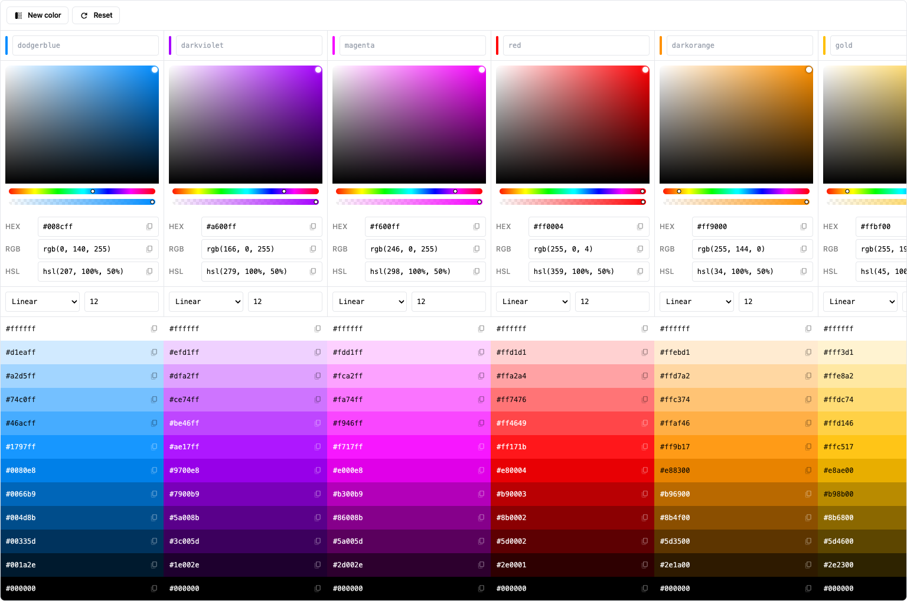

# Chromabox

A color palette generator for designers & developers.



## Self-hosting

Chromabox is available as a SvelteKit app.
You can self-host it by cloning the repo and running it locally.

You'll need [Node v22](https://nodejs.org) or higher.

```bash
git clone https://github.com/fmaclen/chromabox.git
cd chromabox
npm install
npm run build
npm run preview
```

Then, visit `http://localhost:4173` to use the app.
