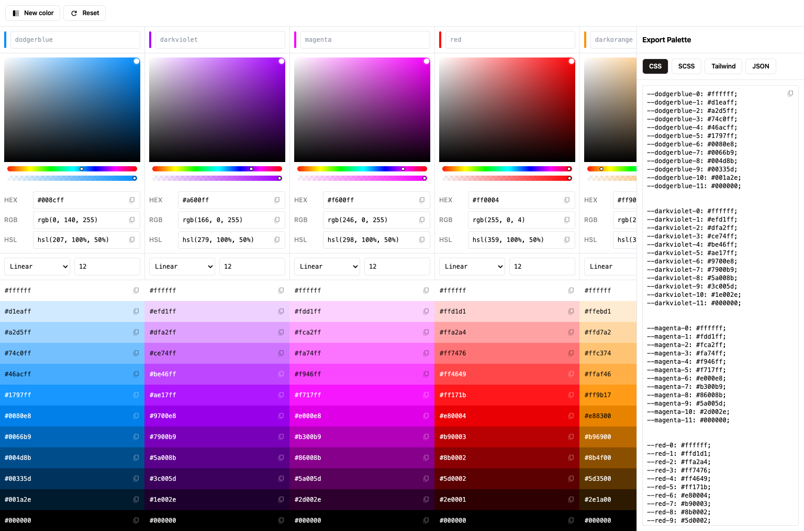

# Chromabox

Generate color variations and export them as Tailwind, SCSS, or CSS variables.
Designed for front-end developers and code-inclined designers.

- ⚡️ [Live demo](https://chromabox.fernando.is)
  - _No sign-up required_
- 🖥️ Download for [macOS, Windows & Linux](https://fmaclen.gumroad.com/l/chromabox)
- 🐳 [Self-hosting](#self-hosting)



## Self-hosting

Chromabox can be run on your own computer as a SvelteKit app.
To do this, clone the repository and run it locally.
Make sure you have [Node.js](https://nodejs.org) installed.

```bash
git clone https://github.com/fmaclen/chromabox.git
cd chromabox
npm install
npm run build
npm run preview
```

Then, visit `http://localhost:4173` to open the app.
