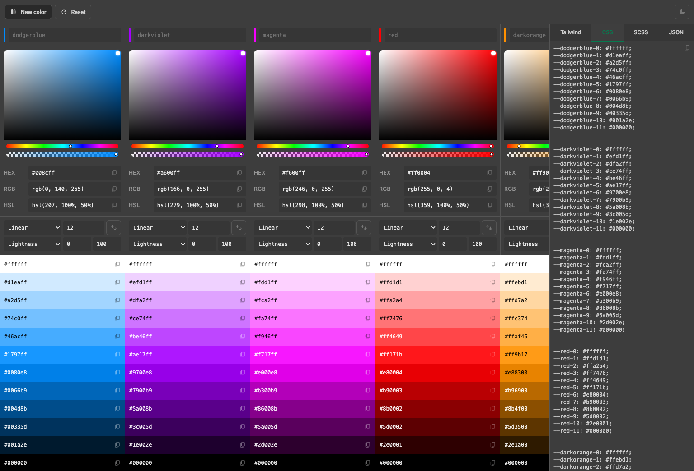

# Chromabox

Chromabox helps developers create and export color palettes for web projects.

Generate color variations, preview them in context, and export them to Tailwind, SCSS, or CSS variables.

- ⚡️ [Live demo](https://hollama.fernando.is)
  - _No sign-up required_
- 🖥️ Download for [macOS, Windows & Linux](https://github.com/fmaclen/hollama/releases)
- 🐳 [Self-hosting](SELF_HOSTING.md)



## Self-hosting

Chromabox is available as a self-hosted SvelteKit app.
You can self-host it by cloning the repo and running it locally.
And you'll need [Node.js](https://nodejs.org) installed.

```bash
git clone https://github.com/fmaclen/chromabox.git
cd chromabox
npm install
npm run build
npm run preview
```

Then, visit `http://localhost:4173` to open the app.
